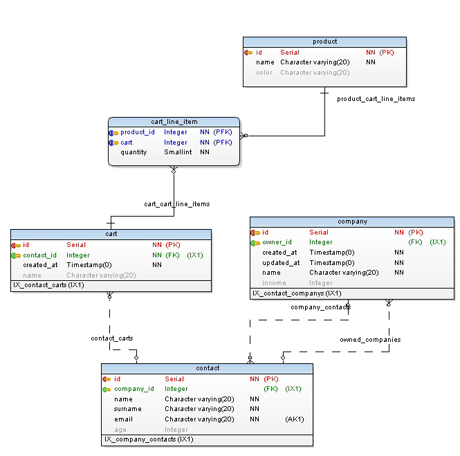

This template is successor of [sequelize-pg-generator](https://www.npmjs.com/package/sequelize-pg-generator) module which is used for creating [sequelize](http://docs.sequelizejs.com) models from existing PostgreSQL database.

## Usage

Create template and model files:

    $ pgen template sequelize -t sequelize-template
    $ pgen exec sequelize-template -d our_crm -u user -p tOpSeCrEt -t model

In your application, create a sequelize object and initialize models with it:

```js
var Sequelize = require("sequelize");
var sequelize = new Sequelize("database", "user", "password", { dialect: "postgres", logging: false });
var model = require("./model/index.js").init(sequelize); // You only need to init once. You can just require later.

model.Company.findOne({ where: { id: 1 } })
  .then(function (company) {
    console.log(company.name);
  })
  .catch(function (error) {
    console.log(err.stack);
  });
```

After you initialized your model, you shouldn't initialize it again and just require your model like below:

```js
var model = require("./model/index.js"); // No init here, because it is initialized before.

// Your code here.
```

## Features:

- Generated model files are as similar as possible to official Sequelize documents.
- Created files are static and transparent. They are not used to create models dynamically. So debugging and seeing what is generated is very easy for humans.
- Documented,
- Tested,
- No Dependencies on generated files,
- Multi schema support,
- One to many relation support (hasMany and belongsTo),
- Many to many relation support (belongsToMany),
- Inter-schema relation support. (i.e. public.account table to other_schema.cutomer table),
- Ultimately configurable and customizable by modifying template files,
- No configuration file to modify,
- CLI support,
- Default smart naming of models and relations,
- Very easy to override auto generated files,
- Table Specific Configuration.

## Template Utility Functions

Templates have passed a variable called `util` which provides some useful utilities.

    type: {{ util.sequelizeType(column) }}  -> type: DataTypes.INTEGER

<a name="uniqueRelatedTables"></a>

### uniqueRelatedTables(table) ⇒ <code>Array.&lt;pgStructure.table&gt;</code>

Returns an array of all tables related to this table. Duplicates are removed, so every related table in the result array is unique.

**Kind**: global function  
**Returns**: <code>Array.&lt;pgStructure.table&gt;</code> - - List of related tables.

| Param | Type                           | Description                                                                                |
| ----- | ------------------------------ | ------------------------------------------------------------------------------------------ |
| table | <code>pgStructure.table</code> | [pg-structure table](http://www.pg-structure.com/api/Table/) to search related tables for. |

<a name="sequelizeType"></a>

### sequelizeType(column) ⇒ <code>string</code>

Returns Sequelize ORM data type for given column.

**Kind**: global function  
**Returns**: <code>string</code> - - Sequelize data type.

| Param  | Type                            | Description                                                            |
| ------ | ------------------------------- | ---------------------------------------------------------------------- |
| column | <code>pgStructure.column</code> | [pg-structure column object](http://www.pg-structure.com/api/Column/). |

**Example**

    {{ util.sequelizeType() }}        // DataTypes.INTEGER(3)
    {{ sequelizeType('Sequelize') }}  // Sequelize.INTEGER(3)

## Relations

Relations are detected automatically. One to many (hasMany), many to one (belongsTo) and many to many (belongsToMany) relations are detected automatically. If two tables are joined via a join table this module detects it automatically and generates many to many sequelize relations. If a table has more than one foreign key, then it is considered join table. In reality it may not be a join table. However it is impossible to detect that.

###Special Case: hasOne###
In short: `hasMany` relations can be converted to `hasOne`relations manually using `custom-data.js`.

Details: _one to one (hasOne)_ relations does not really bring any design benefits. In fact, it would cause performance overheads to the database engine for having to link the table rows together. The 2 tables can actually be combined into a single table. However Sequelize provides `hasOne` type relations. Since there is no way to detect `one to one` relations automatically, they have to be added manually by using [custom data file](http://www.pg-generator.com/template/directories-files/)

For example:
Suppose Company has many Contacts. To make it one to one relation, below example may be added to `custom-data.js`. Please note `Contact` key is singular.

Key should be singular version of `hasMany` aliases.

```js
module.exports = {
  Company: {
    hasOne: {
      Contact: {},
    },
  },
};
```

### Smart Default Naming of Aliases

This template uses table names or schema table names for model naming. For relations it uses foreign key names and relation names from your database. (You are naming your relations in database meaningfully right?) Default template is based on camelCase naming. You can easily change it to use snake_case or PascalCase by using provided filters. Naming conventions are based on Sequelize module suggestions and generated explicitly with 'as' parameter. Aliases can be turned of by providing a custom options file and setting `generateAliases` false.

     module.exports = { generateAliases: false };

| Type of Object | Filters                                | Default Naming & Alias Rule                                                                                                                                                |
| -------------- | -------------------------------------- | -------------------------------------------------------------------------------------------------------------------------------------------------------------------------- |
| table          | classCase                              | Table name.                                                                                                                                                                |
| hasMany        | plural, classCase, stripPrefix(source) | Relation name in database. Table name stripped from beginning.                                                                                                             |
| belongsTo      | singular, classCase, relationName      | Foreign key column name. If name ends with 'id' or '\_id' it will be stripped. Otherwise 'related' is added at the beginning to prevent it from clashing with column name. |
| belongsToMany  | plural, classCase, relationName('')    | Join table name + foreign key in join table which refers to other table. If name ends with 'id' or '\_id' it will be stripped.                                             |



As an example for the schema above aliases are created as follows. Please note names of foreign keys in **cart_line_item** table: **product_id** and **cart**. To demonstrate different naming rules 'product*id' contains \_id* suffix while 'cart' not.

| Relation               | As                   | Why                                                                                                                                                                                                                                       |
| ---------------------- | -------------------- | ----------------------------------------------------------------------------------------------------------------------------------------------------------------------------------------------------------------------------------------- |
| Product.hasMany        | CartLineItems        | <strike style="color:#AAAAAA">product\_</strike>**cart_line_items**: Plural of relation name. Table name is stripped from the beginning of relation name.                                                                                 |
| Product.belongsToMany  | CartLineItemCarts    | **cart_line_item** + **cart** + **s**: Plural of join table name + foreign key column in join table referring to other table. '\_id' suffix is stripped from column name.                                                                 |
| Cart.belongsToMany     | CartLineItemProducts | **cart_line_item** + **product**<strike style="color:#AAAAAA">\_id</strike> + **s**: Plural of join table name + foreign key column in join table referring to other table. '\_id' suffix is stripped from column name.                   |
| Cart.hasMany           | CartLineItems        | <strike style="color:#AAAAAA">cart\_</strike>**cart_line_items**: Plural of relation name. Table name is stripped from the beginning of relation name.                                                                                    |
| CartLineItem.belongsTo | RelatedCart          | **Related** + **cart**: Singular of foreign key column prefixed with _'Related'_. Otherwise 'Cart' relation and 'cart' column collide in same casing (camelCase, ClassCase etc.)                                                          |
| CartLineItem.belongsTo | Product              | **product**<strike style="color:#AAAAAA">\_id</strike>: Singular of foreign key column. Id suffix is stripped from column name. Otherwise 'ProductId' relation and 'product_id' column collide in same casing (camelCase, ClassCase etc.) |

## FAQ

#### I have multiple schema with same table names in them. How can I prevent collision of my model names?<br>

In your template;

- Rename _'sequelize/table/definition/{table.name}.js.nunj.html'_ as _'sequelize/table/definition/{table.schema.name}-{table.name}.js.nunj.html'_.
- Change <span style="font-family:monospace">modelName macro</span> in _'sequelize/table/definition/{table.schema.name}-{table.name}.js.nunj.html'_ as `{{ (table.schema.name + table.name) | classCase }}`.
- Add <span style="font-family:monospace">'{table.schema.name}-'</span> string to <span style="font-family:monospace">'sequelize.import'</span> and <span style="font-family:monospace">'require'</span> parts in _'sequelize/db/index.js.nunj.html'_ file to match new model file's names.

#### I hate aliases that sequelize template generate. What can I do?

You have three choices. You either do:

- Disable aliases all together by creating a file named `option.js` (you can use any name) with content as below:

```js
module.exports = {
  generateAliases: false, // This disables aliases all together. See partials/has-many-nunj.html and other relation templates.
};
```

Feed that file to `pgen`

    $ pgen exec sequelize-template -d our_crm -u user -p tOpSeCrEt -t model --optionsfile options.js

- Or use custom aliases for some or all models by creating a file name `custom-data.js` (you can use any name) with similar content as below:

You can see original and overridden aliases in generated file 'relation-cheatsheet.txt'.

```js
Account: {
    hasMany: {
        HasContacts: {                      // This is the default alias should have generated by pgen.
            as: "'MyBeautifulAlias'"        // This is the alias you want. You renamed 'HasContacts' as 'MyBeautifulAlias'
        }
    },
```

- Or change alias naming for all tables by changing _has-many.nunj.html_, _belongs-to.nunj.html_, _belongs-to-many.nunj.html_ in _partials_ directory of generated **sequelize** template.

#### \*.nunj.html file extension is ugly.

This is not a question. nunj.html extension is chosen because [nunjucks](https://mozilla.github.io/nunjucks/) command line tools expect files with extension **html**. However some IDE's struggle to auto complete/help/color [nunjucks](https://mozilla.github.io/nunjucks/), swig, twig, jinja files with html extension. We can define .nunj.html extension in IDE's to differentiate template files (_.nunj.html) and html (_.html) files correctly and make [nunjucks](https://mozilla.github.io/nunjucks/) command line tools happy.

However if you really like to use another file extension in your templates create template filw tih your desired extension and use `--extension` option of `pgen`

    $ pgen exec sequelize-template -d our_crm -u user -p tOpSeCrEt -t model --extension html
