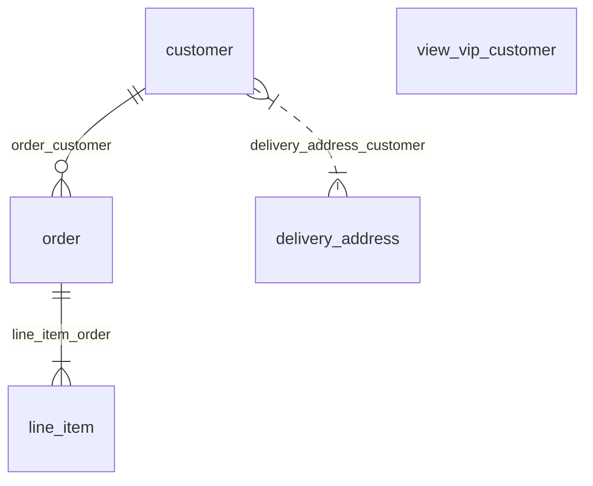

# Introduction

## What is pg-generator

pg-generator is a zero-config template-based scaffolding tool for PostgreSQL. It generates files for each database object (e.g. table, schema, view, column) of a PostgreSQL database.

It processes every template file for each related database object. For example, a template file for a table is executed for each table in the database and written to disk.

## Motivation

We create lots of files, such as ORM models, reports, documentation based on the structure of the database. Synchronizing the files and the structure of the database is a real burden. A team member may forget to update ORM models or database documents after updating the database structure or could make a typo. Additionally, it is a slow and boring job. We developed the pg-generator for those kinds of jobs. Just create template files using your favorite templating engine and voila, pg-generator will create your files again, again, and again.

## Features

- Zero-config. The file tree of template files determines the final result.
- Provides CLI and API.
- Uses [pg-structure](https://www.pg-structure.com) under the hood, so every feature of the [pg-structure](https://www.pg-structure.com) is available in templates.
- Generators are template engine agnostic. You can use your favorite template engine.
- Easy to share generators using npm.
- Supports most of the PostgreSQL objects. Every [class](https://www.pg-structure.com/nav.02.api/) of the pg-structure is available.
- Unlimited customization for relation names using [relation name functions](/nav.01.guide/02.advanced.html#relation-names)

## How It Works?

Below is a simple example of a database and template files of a generator.

### Database



### Template Files of a Generator

Brackets `[]` defines for which database object a template is for (see [classes](https://www.pg-structure.com/nav.02.api)), braces `{}` are for naming generated files, and `#` is used for filtering/converting the file name. For example; a template named `[table] {name}.js.njk` is executed for each database [table](https://www.pg-structure.com/nav.02.api/classes/table) and rendered content is written to disk using the name of the table. Also, the table object is passed to the template as the context data. For readability, an optional single space after brackets `[]` and spaces in braces `{}` are allowed.

```
└─ [db] index.js.njk
   └─ models/
      └─ [table] {schema.name # dash-case}{name # dash-case}.js.njk
      └─ [view] {name # dash-case}.js.njk
```

### Result

```
└─ index.js
  └─ models/
     ├─ public.customer.js
     ├─ public.delivery-address.js
     ├─ public.line-item.js
     └─ view-vip-customer.js
```
