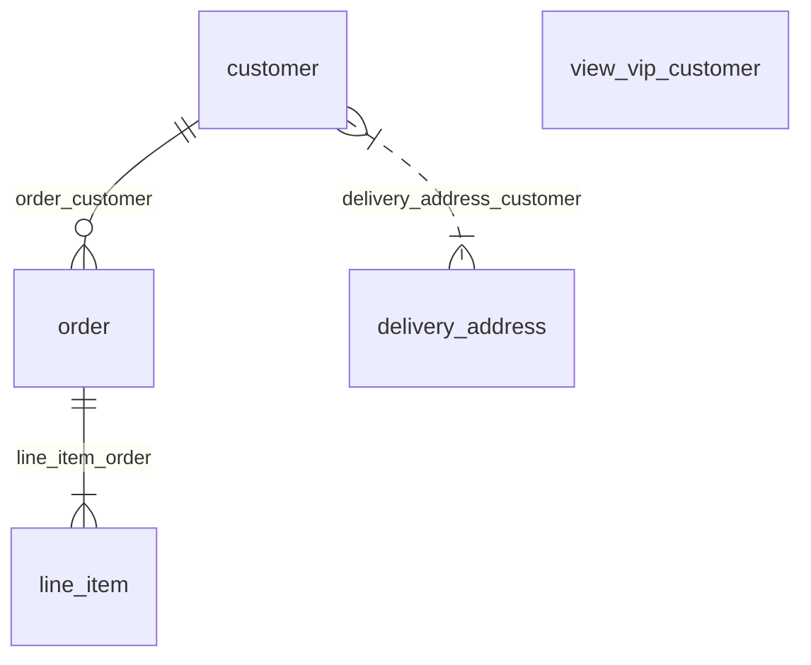

# Adding Templates

pg-generator processes template files located in the `templates` folder in a generator and passes the corresponding database object and custom data provided by the user to the template file.

Template files are executed for each corresponding database object. For example; `[db] index.js` file is processed once and passed the [db object](https://www.pg-structure.com/nav.02.api/classes/db), and `[table] {name}.js.njk` file is processed for each table in the database and passed [table object](https://www.pg-structure.com/nav.02.api/classes/table).

See pg-structure [API](https://www.pg-structure.com/nav.02.api/) for all available objects.

## Template Name

The schema of a template name is as below:

dist/app/templates/**_DESTINATION-DIR_**/_**\[DB-OBJECT\]**_ _**\{ VARIABLE # FILTER \}**_ _**\{ VARIABLE # FILTER \}**_

| Part                  | Description                                                                                                                                                                                                                                                              |
| --------------------- | ------------------------------------------------------------------------------------------------------------------------------------------------------------------------------------------------------------------------------------------------------------------------ |
| **_DESTINATION-DIR_** | The irectory path of the file to be created in the destination.                                                                                                                                                                                                          |
| _**\[DB-OBJECT\]**_   | The type of objects the template is related to (e.g. `db`, `schema`, `table`, `view`, `function` etc. See pg-structure [API](https://www.pg-structure.com/nav.02.api/))                                                                                                  |
| _**\{ VARIABLE \}**_  | The variable to substitute in destination file's name using database object.                                                                                                                                                                                             |
| **_# FILTER_**        | The filter to apply variable name. May be chained to use multiple filters (e.g. `{ name # dash-case # singular }`). Filters may be written using dash-case or camel-case (e.g `class-case` or `classCase`). See [built-in filters](/nav.02.api/modules/filterfunctions). |

### Examples



| Template Path                                    | Destination Path              |
| ------------------------------------------------ | ----------------------------- |
| `models/[table] { name }.js.njk`                 | `models/customer.js`          |
| `models/[table] { name # dash-case }.js.njk`     | `models/line-item.js`         |
| `models/[table]{name#class-case#plural}.js.njk`  | `models/LineItems.js`         |
| `models/{ schema.name }/[table] { name }.js.njk` | `models/public/line_items.js` |

## Context Data

Each template file is passed a context object. This context object contains the corresponding database object (e.g. `table`, `schema` etc.). Templates can access the database object either using object class name in camel case (e.g. `table`, `materailzedView` etc.) or using `o`.

Also, a generator may add additional context data needed in templates too. For example, `pg-generator-example` sub-generatorsequelize6`adds sequelize types to be used in templates. Additionally, a generator may define default values in the context it adds, and provide the end-user the opportunity to change them using a custom context file or context module.`sequelize6`adds`addSchemaName`key with the default value`true` to decide whether to use PostgreSQL schema names in class names in generated files.

A generator may add context data using `context()` method.

```ts
export default class App extends PgGenerator {
  context() {
    return {
      addSchemaName: true,
    };
  }
}
```

### Special Keys

There are some special keys in context.

Data under the `global` key is sent to all templates all the time.

Using the database object name in plural with the name of the target object, it is possible to send data to the template when that template is processed with the particular database object.

For example, using the context below it is possible to send `skip: true` value only to table templates when they are processed with `public.product` table and `message: "Hello!"` to only schema templates when they are processed with `public` schema.

```json
{
  "tables": {
    "public.product": {
      "skip": true
    }
  },
  "schemas": {
    "public": {
      "message": "Hello!"
    }
  }
}
```

## Example

Below example is a nunjucks template that creates a markdown file for each table.

**templates/[table] {name}.js.njk**

```md
# {{ table | dboClassName(addSchemaName) | quote }}

| Column | Type |
| ------ | ---- |


|{{ column.name }}|{{ column.type.name }}{{ column | dboColumnTypeModifier }}|

```

The template first creates the title with the table's name. It uses the builtin [dboClassName](/nav.02.api/modules/filterfunctions.html#dboclassname) filter. `dboClassName` returns a class name using filtered database object. It takes a boolean parameter to decide whether to add PostgreSQL schema name to the class name. `addSchemaName` variable is taken from context. It's a good choice to provide a default value in the generator. The end-user may override it using a custom context file or context module.

Then, the template creates a markdown table by looping through all columns of the table from context added by pg-generator automatically. [dboColumnTypeModifier](http://localhost:8080/nav.02.api/modules/filterfunctions.html#dbocolumntypemodifier) is also another built-in filter, which returns PostgreSQL data type modifiers of precision and scale such as `(1,2)`.

The returned content is written to disk.

## Tip

See [pg-generator-example](https://www.npmjs.com/package/pg-generator-example) plugin for an example, how to develop your generators. It provides examples of:

- Sub-generators for popular ORMs, markdown with mermaid support, and a report.
- Custom filters
- Custom context
- Shared partial usage
