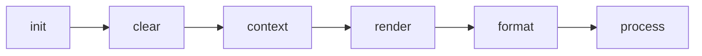

# Generators

Generators are pg-generator plugins developed as Node.js modules. pg-generator creates files for the database structure using generators. A generator contains one or more sub-generators. Sub generators are JavaScript files exporting a default class that extend [PgGenerator Class](/nav.02.api/classes/pggenerator.html) and have a templates folder.

Most of the time, it is enough to only add a `render()` method and return rendered content using your favorite template engine. Nonetheless, `PgGenerator` has more methods that act as hooks for advanced usage scenarios. You can read method API in the API [docs](/nav.02.api/classes/pggenerator.html#class-pggenerator-o). They are called in the following order:



## Methods

### Init

[init](http://localhost:8080/nav.02.api/classes/pggenerator.html#init) method is called after clear, and before any other operation.

Below is an example to make a backup before writing to the destination.

```ts
import { join } from "path";
import { copy } from "fs-extra";

export default class App extends PgGenerator {
  protected async init(): Promise<any> {
    await copy(this.destinationPath(), join(this.destinationPath(), "-backup"));
  }
}
```

### Clear

[clear](http://localhost:8080/nav.02.api/classes/pggenerator.html#clear) method is called only `clear` option is true. By default, it deletes the output directory. You may override this method to customize the operation.

Below is an example to delete only some files instead of deleting the whole directory.

```ts
import { join } from "path";
import { del } from "del";

export default class App extends PgGenerator {
  protected async init(): Promise<any> {
    await del(`${this.destinationPath()}/*.md`);
  }
}
```

### Context

[context](http://localhost:8080/nav.02.api/classes/pggenerator.html#context) method is used to send custom context data to the templates. You may return an object to merge into context. End-users may override those data using the `contextFile` option.

```ts
export default class App extends PgGenerator {
  protected context(): Record<string, any> {
    return { global: { addSchemaName: true } };
  }
}
```

Context is the data passed to the templates as an object. pg-generator automatically passes related database object with a key that is equal to database object type (e.g. `db`, `schema`, `table`, `view`, `function` etc. See available [classes](https://www.pg-structure.com/nav.02.api)). The key `o` is an alias to the database object.

In addition to the database object, generators may add any data to the context object and provide default values for them. Those extra data may be used as a configuration to change the behavior of the templates.

### Render

[render](http://localhost:8080/nav.02.api/classes/pggenerator.html#render) method is **the most important** method. The template file's path and the context data are passed to the `render` method as parameters. You should return rendered content using the template and the context.

```ts
import engine from "my-favorite-template-engine";

export default class Md extends PgGenerator {
  protected async render(templatePath: string, context: Context): Promise<string> {
    return engine.render(templatePath, context);
  }
}
```

### Format

[format](http://localhost:8080/nav.02.api/classes/pggenerator.html#format) method is called after content is rendered but before it is written to the disk. By default pg-generator formats the content using [prettier](https://prettier.io). In case you need to change the default behavior you may use this method. The destination path and the content are passed to the `format` method. You should return formatted content.

```ts
export default class Md extends PgGenerator {
  protected format(destination: string, content?: string): Promise<undefined | string> | undefined | string {
    return myFormatter.format(content);
  }
}
```

### Process

[process](http://localhost:8080/nav.02.api/classes/pggenerator.html#process) method writes given content to the given destination file. If you would like to change the default behavior, you may override this method.

Below is a very rough example of posting the content to a server instead of writing to disk.

```ts
import { post } from "axios";
import { basename } from "path";

export default class Md extends PgGenerator {
  protected process(destination: string, content: string): Promise<any> | any {
    await post(`http://myserver.com/model/${basename(destination)}`, content);
  }
}
```
